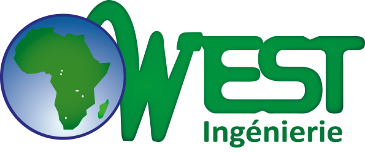
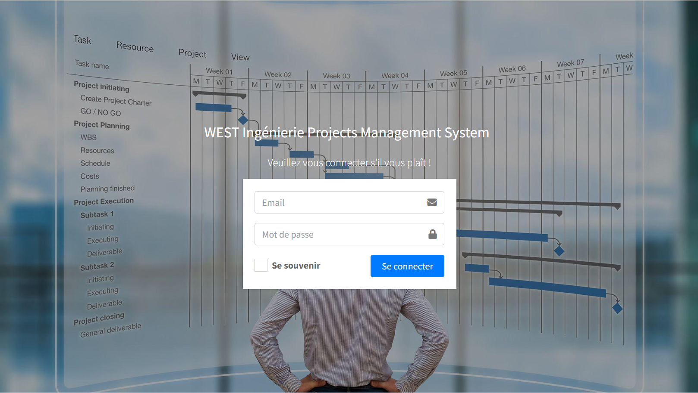
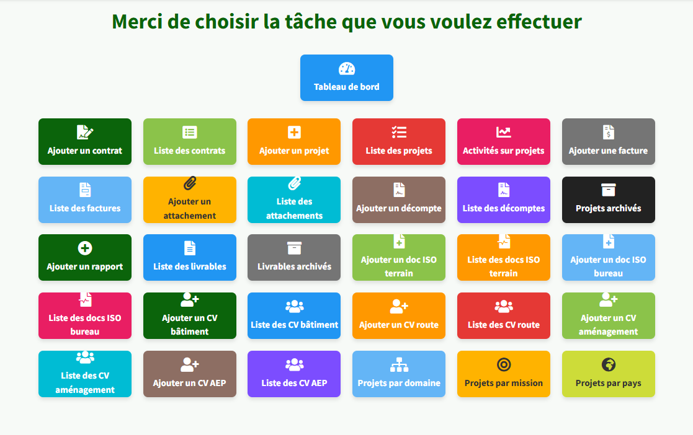
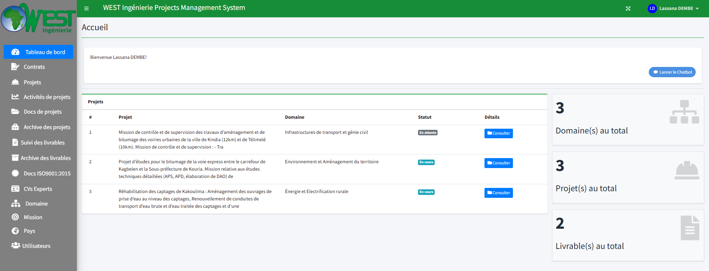
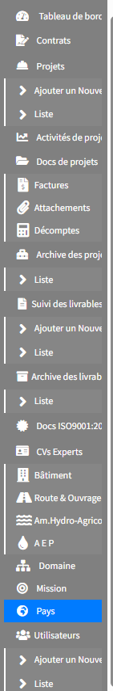

<p align="center">
    <a href="https://github.com/lassana99" target="_blank">
        
    </a>
</p>

<h1 align="center">WEST_PMS : Solution de Pilotage de Projets & Assistance IA</h1>

<p align="center">
    <strong>Système de Gestion de Projet (PMS) sur mesure développé pour West Ingénierie.</strong><br>
    <em>Une plateforme robuste en PHP Natif alliant gestion opérationnelle et Intelligence Artificielle.</em>
</p>

---

## Aperçu de la Plateforme

### Sécurité & Accès
L'interface de connexion garantit un accès sécurisé aux collaborateurs de West Ingénierie, avec une gestion stricte des sessions utilisateurs.
<p align="center">
  
</p>

###  Interface d'Accueil
Dès la connexion, l'utilisateur accède à une interface claire listant les projets prioritaires et les notifications récentes.
<p align="center">
  
</p>

### Tableau de Bord & Analytics
Le Dashboard centralise les indicateurs de performance (KPI) grâce à une intégration fluide de **Chart.js**, permettant de suivre l'avancement des chantiers et des budgets en un coup d'œil.
<p align="center">
  
</p>

### Innovation : Chatbot Intelligent
WEST_PMS intègre un **Chatbot IA** (OpenAI API) accessible via le menu, permettant aux ingénieurs d'interroger le système en langage naturel pour obtenir des informations sur les projets ou des rapports de synthèse.
<p align="center">
  
</p>

---

## Fonctionnalités Principales

- **Gestion du Cycle de Vie des Projets** : Création, planification, suivi des jalons (milestones) et archivage technique.
- **Assistance IA (Chatbot)** : Interface conversationnelle pour la recherche d'informations et l'aide à la décision.
- **Pilotage des Ressources** : Attribution des tâches aux ingénieurs et suivi de la charge de travail en temps réel.
- **Reporting Dynamique** : Visualisation des données financières et opérationnelles via des graphiques interactifs.
- **Gestion Documentaire** : Centralisation et sécurisation des plans techniques et rapports d'ingénierie.

## Stack Technique

- **Langage Backend** : PHP 8.2 (Architecture Native / Modulaire)
- **Base de Données** : MySQL (Modèle Relationnel optimisé)
- **Frontend** : HTML5, CSS3 (Bootstrap 5), JavaScript ES6
- **Intelligence Artificielle** : Intégration API OpenAI (GPT)
- **Visualisation de Données** : Chart.js
- **Communication Client-Serveur** : AJAX / JSON

## Installation & Configuration

1. **Cloner le dépôt** :
   ```bash
   git clone https://github.com/lassana99/west-pms-gestion-de-projet.git